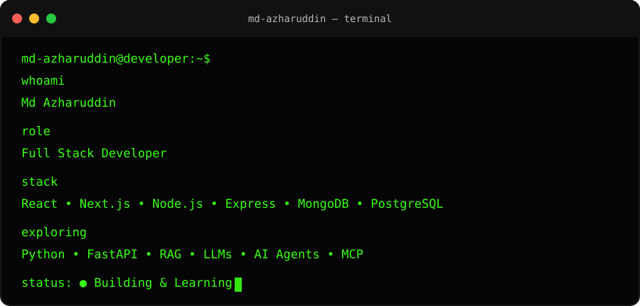
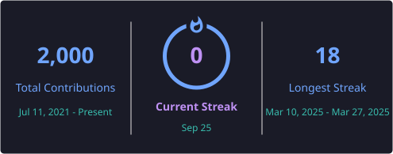

<h1 align="center">
  Hi there, I'm Md Azharuddin
  
</h1>

  

  <strong>Full Stack Developer • MERN • Next.js • Backend • AI Engineering</strong>

  Building scalable, production-ready web applications, real-time systems,
  REST APIs, and AI-powered solutions.

  
  &nbsp;
  
  &nbsp;
  

  

<table>
  <tr>
    <td valign="top" width="60%">

🧩 About Me

Full Stack Developer specializing in the MERN stack, focused on building fast, scalable, maintainable, and production-ready web applications.

🧠 Experienced with React, Next.js, Redux Toolkit, and frontend performance optimization

⚡ Hands-on with SSR, code splitting, lazy loading, and modern frontend architecture

⚙️ Experienced in Node.js, Express.js, and FastAPI for REST APIs and backend services

🗄️ Worked with MongoDB, PostgreSQL, and MySQL, including schema design and query optimization

🔐 Implemented JWT authentication, RBAC, rate limiting, and secure API architectures

☁️ Hands-on with AWS, Docker, and CI/CD pipelines using GitHub Actions

📡 Built real-time applications using WebSockets and Socket.IO

</table>

💻 Developer Terminal

  

🛠️ What I Build

<table>
  <tr>
    <td width="50%" valign="top">

🌐 Full-Stack Applications

Production-ready applications using modern frontend and backend architectures.

React · Next.js · Node.js · Express

</td>
<td width="50%" valign="top">

⚡ Real-Time Systems

Real-time experiences powered by WebSockets and event-driven communication.

WebSockets · Socket.IO · Redis

</td>

  </tr>
  <tr>
    <td width="50%" valign="top">

🔐 Backend & APIs

Secure and scalable APIs with authentication, authorization, and rate limiting.

Node.js · Express · FastAPI · JWT · RBAC

</td>
<td width="50%" valign="top">

📊 SaaS & Business Platforms

Practical software for inventory, retail workflows, business operations, and automation.

MongoDB · PostgreSQL · REST APIs

</td>

  </tr>
  <tr>
    <td width="50%" valign="top">

🤖 AI-Powered Applications

Exploring practical applications of LLMs, RAG, vector search, and AI agents.

LLMs · RAG · Embeddings · AI Agents

</td>
<td width="50%" valign="top">

☁️ Cloud & DevOps

Deploying and maintaining applications with modern cloud and CI/CD workflows.

AWS · Docker · GitHub Actions · Vercel

</td>

  </tr>
</table>

🚀 Currently Exploring

  

  
  
  
  
  

Expanding beyond the MERN stack into Python, FastAPI, Generative AI, RAG, vector search, AI agents, MCP, and backend architecture.

🚀 Featured Projects

<table>
  <tr>
    <td width="50%" valign="top">

💬 Real-Time Chat Application

A WhatsApp-style real-time messaging application built with the MERN stack.

Tech: React · Node.js · Express · MongoDB · Socket.IO · Redux

⚡ Real-time messaging

💬 Typing indicators

🤖 AI-powered conversations

🔐 JWT authentication

📡 WebSocket communication

📱 Responsive interface

🔗 Live Demo: Add your link
💻 Source Code: Add your repository link

</td>
<td width="50%" valign="top">

🏪 RetailOS

A multi-tenant retail management platform designed for small businesses.

Tech: React · Node.js · Express · MongoDB · AI

📦 Inventory management

🧾 Sales & purchase management

🔎 Product search

📊 Business dashboard

🏷️ Barcode-oriented workflows

🤖 AI-powered features

🔗 Live Demo: Add your link
💻 Source Code: Add your repository link

</td>

  </tr>
  <tr>
    <td width="50%" valign="top">

💊 Pharmacy Management System

A practical pharmacy management solution focused on inventory and product management.

Tech: Next.js · Node.js · MongoDB

📦 Medicine inventory

🔍 Product search

📱 Responsive UI

🗺️ Business location integration

💬 WhatsApp integration

🔗 Live Demo: Add your link
💻 Source Code: Add your repository link

</td>
<td width="50%" valign="top">

🤖 AI / RAG Experiments

Exploring practical applications of LLMs, RAG, and AI-powered developer tools.

Tech: Python · FastAPI · RAG · Vector DB · LLM APIs

🧠 Retrieval Augmented Generation

🔎 Semantic search

🤖 LLM integration

⚙️ AI workflows

🔗 API-based AI applications

💻 Source Code: Add your repository link

</td>

  </tr>
</table>

🤖 AI Engineering Journey

  
  
  
  
  
  
  

  <strong>Learn → Experiment → Build → Integrate → Ship</strong>

📊 Developer Metrics

  
  

  
  

🔥 GitHub Stats

  
  &nbsp;
  

  

📈 Contribution Activity

  

🐍 Contribution Snake

  <picture>
    <source
      media="(prefers-color-scheme: dark)"
      srcset="./profile/contribution-snake-dark.svg"
    />
    <source
      media="(prefers-color-scheme: light)"
      srcset="./profile/contribution-snake.svg"
    />
    
  </picture>

🧰 Tech Stack

💻 Languages

  
  
  

⚛️ Frontend

  
  
  
  

⚙️ Backend

  
  
  
  

🗄️ Databases

  
  
  
  

☁️ Cloud & DevOps

  
  
  
  
  
  

🛠️ Tools

  
  
  
  

🏆 Achievements

  
  &nbsp;
  
  &nbsp;
  

📈 My Developer Workflow

  <strong>
    💡 Idea
    &nbsp;→&nbsp;
    🧩 Architecture
    &nbsp;→&nbsp;
    💻 Build
    &nbsp;→&nbsp;
    🧪 Test
    &nbsp;→&nbsp;
    🔍 Debug
    &nbsp;→&nbsp;
    🚀 Deploy
    &nbsp;→&nbsp;
    📊 Monitor
    &nbsp;→&nbsp;
    🔁 Iterate
  </strong>

🎯 Current Focus

<table>
  <tr>
    <td align="center" width="25%">
      <h3>⚛️</h3>
      <strong>Frontend</strong> 
      React · Next.js
    </td>
    <td align="center" width="25%">
      <h3>⚙️</h3>
      <strong>Backend</strong> 
      Node.js · FastAPI
    </td>
    <td align="center" width="25%">
      <h3>🤖</h3>
      <strong>AI Engineering</strong> 
      LLM · RAG · Agents
    </td>
    <td align="center" width="25%">
      <h3>🏗️</h3>
      <strong>Architecture</strong> 
      System Design · APIs
    </td>
  </tr>
</table>

  
  
  
  
  

🧭 Engineering Interests

<table>
  <tr>
    <td align="center" width="33%">
      <strong>🌐 Full Stack</strong> 
      React · Next.js 
      Node.js · APIs
    </td>
    <td align="center" width="33%">
      <strong>⚡ Real-Time</strong> 
      WebSockets · Socket.IO 
      Event-driven systems
    </td>
    <td align="center" width="33%">
      <strong>🤖 AI Engineering</strong> 
      LLMs · RAG 
      Agents · MCP
    </td>
  </tr>
  <tr>
    <td align="center">
      <strong>🏗️ Backend</strong> 
      Node · FastAPI 
      Auth · RBAC
    </td>
    <td align="center">
      <strong>☁️ Cloud & DevOps</strong> 
      AWS · Docker 
      CI/CD
    </td>
    <td align="center">
      <strong>📊 SaaS</strong> 
      Business platforms 
      Automation
    </td>
  </tr>
</table>

✍️ Quote of the Day

  

🤝 Let's Connect

  Interested in collaborating around
  <strong>Full Stack · Backend · AI · SaaS · Developer Tools</strong>?

  
  &nbsp;
  
  &nbsp;
  

  

  <strong>Keep building. Keep learning. Keep shipping. 🚀</strong>

  

